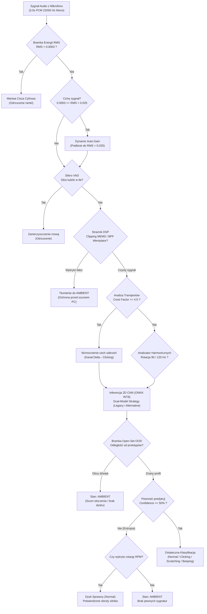

# Kontekst Projektu i Kompendium Wiedzy Inżynierskiej — Acoustic HDD Sentinel

> **Data aktualizacji:** 22 listopada 2026 r.  
> **Cel dokumentu:** Pełne, usystematyzowane podsumowanie wszystkich dotychczasowych etapów rozwoju, sesji badawczych, audytów forensicznych, decyzji architektonicznych (ADR-001, ADR-002), modułu mobilnego Android (czysta Java 17, wzorzec Dual-Model Strategy, tryb RAW Audio z deaktywacją AudioFx i dynamiczną kalibracją czułości, nowoczesny interfejs Material 3 z pulsującym radarem), silnika hybrydowego z analizą harmonicznych RPM, strażników DSP i odporności OOD/Adversarial, testów laboratoryjnych na 4 fizycznych dyskach twardych oraz wdrożenia na fizycznym smartfonie.

---

## 1. Cel i Wymagania Główne Projektu

Projekt **Acoustic HDD Sentinel** to system wibroakustycznej detekcji i wieloklasowej klasyfikacji uszkodzeń mechanicznych dysków twardych (HDD) przy użyciu głębokich sieci konwolucyjnych (2D CNN) oraz fizycznych strażników cyfrowego przetwarzania sygnałów (DSP). System klasyfikuje stan nośnika na podstawie krótkich, 3-sekundowych okien dźwiękowych do jednej z 4 klas:
1. **`normal`** – sprawny dysk (laminarny szum łożyska hydrodynamicznego FDB, stabilne obroty talerzy 5400/7200 RPM, miękkie pozycjonowanie głowic),
2. **`clicking`** – uderzanie głowic o ogranicznik (*Click of Death*, awaria przedwzmacniacza, zerwanie zawieszenia głowicy lub uszkodzenie ścieżek servo),
3. **`scratching`** – fizyczne tarcie i żłobienie powierzchni talerzy magnetycznych przez zniszczone głowice (*head crash*, katastrofalne mikro-skrawanie nośnika),
4. **`beeping`** – zablokowanie osi silnika wrzeciona BLDC (*seized spindle motor*) lub przylepienie głowic do powierzchni talerza (*stiction*).
5. **Stan otoczenia (`ambient` w silniku hybrydowym / Androidzie):** brak kontaktu z pracującym dyskiem twardym, szum wentylatorów, mowa lub tło akustyczne.

---

## 2. Niezmienniki Techniczne (Invariants — ADR-001 & ADR-002)

1. **Brak Data Leakage (Zero Data Leakage):**
   Podział na zbiory `train`, `validate` i `test` **musi** odbywać się wyłącznie na poziomie całych nagrań źródłowych przed ich podziałem na 3-sekundowe okna czasowe. Zabrania się losowego `train_test_split` na pociętych wycinkach `.npy`.
2. **Kształt tensora wejściowego:**
   - Na dysku w plikach `.npy`: tensor `float32` o stałych wymiarach **`(128, 259, 3)`** (Channel-Last).
   - W pamięci modelu PyTorch: tensor `(B, 3, 128, 259)` (Channel-First). Klasa `AcousticHddSentinelCNN` transparentnie obsługuje oba układy.
3. **Parametry potoku DSP:**
   - Częstotliwość próbkowania: `TARGET_SR = 22050` Hz
   - Długość okna FFT: `N_FFT = 1024` (okno Hanna, szerokość pasma prążka $\Delta f = 21.53$ Hz)
   - Krok przemieszczenia: `HOP_LENGTH = 256` (krok $\approx 11.6$ ms – krytyczny dla zachowania transjentów o wysokim współczynniku szczytu *Crest Factor*)
   - Liczba filtrów Mel: `N_MELS = 128` w paśmie od $50.0$ Hz do $10000.0$ Hz
   - Czas okna ewaluacyjnego: `CHUNK_DURATION = 3.0` s ($66 150$ próbek)
   - Augmentacja nakładania: `OVERLAP = 1.5` s (50%) **wyłącznie dla zbioru `train`**; dla `validate` i `test` overlap wynosi bezwzględnie `0.0` s (krok co 3.0 s).
   - Noise Gate / Silence Rejection: odrzucanie ramek o energii $RMS < 0.0003$ w torze wejściowym (ochrona przed martwą ciszą cyfrową).
4. **Izolacja normalizacji dwustopniowej:**
   - Krok 1 (Waveform): Odcięcie składowej stałej (DC offset) + normalizacja szczytowa Peak do $[-1.0, 1.0]$.
   - Krok 2 (Tensor): Standaryzacja Z-Score niezależnie per kanał ($\mu = 0.0$, $\sigma = 1.0$) z zabezpieczeniem $\epsilon = 10^{-6}$.
5. **Niezmiennik VRAM (16 GB dGPU + iGPU):**
   Środowisko graficzne i pulpit działają na procesorze iGPU (Ryzen 7 7700), dzięki czemu karta AMD Radeon RX 9060 XT (16 GB) ma 100% wolnej pamięci VRAM na zadania uczenia maszynowego ROCm oraz lokalne LLM. Modele LLM są wyładowywane (`keep_alive=0`) przed rozpoczęciem treningu PyTorch.
6. **Niezmiennik Mobilny ADR-002 (Czysta Java 17):**
   Moduł aplikacji mobilnej Android jest napisany w 100% w czystej Javie 17 (0 plików Kotlina, brak narzutu bibliotek uruchomieniowych `kotlin-stdlib` i Room). Wykorzystuje czysty `SQLiteOpenHelper`, architekturę MVVM z `LiveData`, oraz silnik inferencyjny ONNX Runtime Mobile INT8.

---

## 3. Chronologiczna Historia Rozwoju i Ewolucja Systemu

### Faza 1: Architektura Bazowa i Pipeline DSP (TensorFlow / Keras)
*(Identyfikatory sesji: `d7cdbb65`, `cb4488fd`)*
- Zdefiniowano reprezentację czasowo-częstotliwościową w postaci 3-kanałowego tensora `(128, 259, 3)` w [ADR-001](docx/adr/adr.md):
  - **Kanał 0:** Log-Mel Spektrogram (rezonanse, harmoniczne obrotowe silnika, piski),
  - **Kanał 1:** Delta – 1. pochodna czasowa Savitzky'ego-Golaya (transjenty, impulsowe klikanie głowic),
  - **Kanał 2:** Delta-Delta – 2. pochodna czasowa (dynamika przyspieszeń i zmian kątowych).
- Stworzono bazowy enkoder audio [ml/hdd_audio_encoder.py](ml/hdd_audio_encoder.py), kategoryzator [ml/prepare_audio_dataset.py](ml/prepare_audio_dataset.py) oraz profiler [tests/profile_normalization_quality.py](tests/profile_normalization_quality.py).
- Wdrożono pierwszy model 2D CNN w TensorFlow/Keras.

---

### Faza 2: Rygorystyczny Audyt Zewnętrzny, Stress-Testy i Analiza Forensyczna
*(Identyfikator sesji: `ad8cb723`)*
- Przygotowano pakiet audytowy [docx/AUDIT_REVIEW_BUNDLE.md](docx/AUDIT_REVIEW_BUNDLE.md) i poddano kod niezależnej weryfikacji.
- **Wykryte wady i anomalie (Acoustic Forensics):**
  - **DC Offset:** Wykryto silne przesunięcie składowej stałej ($+0.3766$), zaburzające Peak Normalization. Wdrożono centrowanie sygnału (`audio - np.mean(audio)`).
  - **Artefakty zapętlania (`np.tile`):** Zapętlanie krótkich nagrań generowało sztuczne skoki fazowe na stykach ramek, które sieć błędnie interpretowała jako stukanie głowicy (`clicking`).
  - **Shortcut Learning w klasie `normal`:** Syntetyczny generator zdrowych dysków filtrował szum powyżej 2400 Hz, przez co sieć uczyła się odróżniać sprawny dysk po braku wysokich częstotliwości.
- Opracowano [tests/stress_test.py](tests/stress_test.py) oraz [tests/stress_test_vram.py](tests/stress_test_vram.py) do weryfikacji stabilności pamięci RAM/VRAM i latencji p95 podczas wielogodzinnej inferencji.

---

### Faza 3: Pełna Migracja na PyTorch i Akceleracja AMD ROCm (RX 9060 XT)
*(Identyfikator sesji: `75303e14`)*
- Przepisano cały stos na czysty PyTorch (`AcousticHddSentinelCNN` w [ml/model_cnn.py](ml/model_cnn.py) z 1 206 756 parametrami).
- Usunięto TensorFlow/Keras ze środowiska i repozytorium.
- Skonfigurowano akcelerację AMD ROCm 7.2 / HIP dla architektury ISA `gfx1200` (RDNA 4) w dedykowanym środowisku `.venv_rocm`.
- **Wynik wydajnościowy:** Czas epoki treningowej skrócił się z ~16 s na CPU do **~1.9 s na GPU (ponad 8-krotne przyspieszenie)**.

---

### Faza 4: Rozwiązanie Problemu Scratching/Beeping i Fine-Tuning
*(Identyfikatory sesji: `0c62a67c`, `3c821c7b`)*
- Zdiagnozowano przyczyny załamania metryk ($F1 = 0.00$ dla `scratching` i $F1 \approx 0.20$ dla `beeping`):
  - Utrata oryginalnych nazw 82 plików z bazy Northwind doprowadziła do fałszywych heurystyk spektralnych.
  - Plik `Audio_Player_57.wav` okazał się duplikatem klikającego Samsunga SP8002 oznaczonym jako `beeping`.
  - Z-score na bardzo cichym szumie ($RMS < 0.002$) sztucznie rozciągał szum mikrofonu.
- Pobrano autentyczne pliki MP3 z serwera Northwind z oryginalnymi nazwami oraz pozyskano 11 nowych nagrań laboratoryjnych uszkodzeń.
- Zbalansowano zbiór `train` (1389 tensorów, pitch-shift $\pm 1.5$ półtonu dla klas rzadkich) i zachowano w 100% czysty zbiór `test` (117 tensorów bez augmentacji).
- Zastosowano `AdamW` (`weight_decay=1e-4`), `LabelSmoothingCrossEntropy(0.03)` oraz `ReduceLROnPlateau`.
- **Wynik:** Wszystkie klasy przekroczyły próg $F1 \ge 0.70$, a średnia **Macro F1 osiągnęła 84.63%** przy luce generalizacyjnej równej **2.04 p.p.**

---

### Faza 5: Usunięcie Nadmiarowości i Wdrożenie Seed Ensembling
*(Identyfikator sesji: `4f1178fe`)*
- Usunięto zduplikowany katalog roboczy `CNN/` i stare pliki aliasowe, zwalniając ponad 840 MB.
- Zaimplementowano technikę Seed Ensembling ([ml/train_ensemble.py](ml/train_ensemble.py)) tworzącą komitet modeli (`FusedEnsemblePyTorch`) o ziarnach 42, 123 i 777.
- Zintegrowano moduł eksportu modeli [ml/export_model.py](ml/export_model.py) wspierający ONNX FP32, skwantyzowany ONNX INT8 oraz TorchScript.

---

### Faza 6: Architektura Mobilna i Standard ADR-002
*(Identyfikator sesji: `3cd6e5ea`)*
- Sformułowano decyzję architektoniczną [docx/adr/adr-002-mobile-architecture.md](docx/adr/adr-002-mobile-architecture.md).
- Dokonano wyboru silnika inferencji brzegowej: **ONNX Runtime Mobile INT8** (redukcja rozmiaru o 74.6% z 4.61 MB do **1.17 MB**, czas inferencji 18–32 ms, parzystość z PyTorch $< 10^{-8}$).
- Dodano automatyczną synchronizację wyeksportowanych wag do katalogu assets aplikacji mobilnej (`android/app/src/main/assets/`).

---

### Faza 7: Pełna Implementacja Natywnej Aplikacji Android w Czystej Javie 17
*(Identyfikatory sesji: `d48d1a3`, `7a9fb66`, `5878593`)*
- Zgodnie z wymaganiami programowymi studiów i ADR-002, całą aplikację Android zaimplementowano w **100% w czystej Javie 17** (bez narzutu bibliotek uruchomieniowych Kotlina i Room):
  - **`audio/AudioRecorder.java`:** Pętla rejestracji dźwięku z buforem kołowym, wsparciem dla 22050 Hz oraz awaryjnego 44100 Hz.
  - **`dsp/AudioPreprocessor.java`:** Wierna implementacja Radix-2 FFT, okna Hanna, trójkątnego banku filtrów Mel i wag Savitzky'ego-Golaya w Javie dająca tensory tożsame z Librosa.
  - **`ml/AcousticClassifier.java`:** Inferencja `OrtSession` z optymalizacją pamięciową i mapowaniem etykiet.
  - **`data/DiagnosticDbHelper.java`:** Czysty `SQLiteOpenHelper` z pełną historią diagnoz i eksportem (wraz z `DiagnosticModel.java` i `DiagnosticRepository.java`).
  - **`ui/MainActivity.java` & `MainViewModel.java`:** Wzorzec MVVM z `LiveData`, interfejs Material 3 z pulsującym radarem, animowanymi falami oraz mechanizmem **Early Stopping** (natychmiastowe zatrzymanie przy pewności $\ge 75-80\%$ lub konsensusie okien).
- Utworzono 8 kompleksowych klas testowych obejmujących 37 testów jednostkowych w czystej Javie zdanych w 100%.

---

### Faza 8: Strażnik Fizyczny (DSP Guard), Odporność OOD i Ataki Adwersarialne
*(Identyfikatory sesji: `d088918`, `efd4929`)*
- Utworzono laboratorium weryfikacji odporności [tests/adversarial_lab/](tests/adversarial_lab/):
  - **Szum wentylatorów chłodzenia PC:** Analiza widma $1/f$ oraz częstotliwości przejścia łopatek (Blade Passing Frequency – BPF). Wentylatory generują łagodne, opadające widmo bez transjentów, które surowa sieć mogła mylić z tarciem talerza (`scratching`). Wdrożono detektor `is_aerodynamic_fan`.
  - **Przesterowania mikrofonów MEMS (Flat-Top Clipping):** Tanie mikrofony smartfonów w bliskim kontakcie z obudową dysku wchodzą w nasycenie (obcinanie wierzchołków fali). Obcięcie generuje sztuczne nieparzyste harmoniczne (wysokie THD), które sieć brała za tarcie. Wdrożono detekcję `clipping_ratio > 0.015` w strażniku DSP.
  - **Mowa ludzka w tle:** Zintegrowano model **Silero VAD (16 kHz)**, automatycznie odrzucający fragmenty zanieczyszczone głosem serwisanta.
  - **Bramkowanie Open-Set (OOD Prototype Rejection):** Wbudowano w warstwę sieci `AcousticHddSentinelCNN` i wyeksportowano bezpośrednio do grafu ONNX bufory prototypów cech klas uszkodzeń (`fault_prototypes`, `fault_thresholds`, `gamma`). Jeśli wektor cech odległy jest od prototypów znanych awarii, logity uszkodzeń są tłumione funkcją sigmoid w dół, uniemożliwiając fałszywy alarm na dźwiękach spoza rozkładu (OOD).

---

### Faza 9: Analizator Harmonicznych Rotacji Silnika Wrzeciona (RPM Harmonics Analyzer)
*(Moduły: [ml/rpm_harmonics_analyzer.py](ml/rpm_harmonics_analyzer.py) oraz w Javie w `AudioPreprocessor.java`)*
- Każdy obracający się dysk HDD emituje ściśle określoną częstotliwość podstawową wirowania silnika bezszczotkowego BLDC:
  - **5400 RPM:** $f_0 = 90.0$ Hz (dopuszczalne pasmo $86 - 94$ Hz)
  - **7200 RPM:** $f_0 = 120.0$ Hz (dopuszczalne pasmo $116 - 124$ Hz)
- Algorytm estymuje gęstość widmową mocy metodą Welcha (okno 4096 próbek, rozdzielczość $\approx 5.38$ Hz).
- Wykrywa prążek $f_0$, jego wielokrotności $2f_0, 3f_0, 4f_0$ oraz harmoniczne stojana silnika dla dysków 2.5" ($810 - 900$ Hz).
- Potwierdzenie rotacji wrzeciona stanowi bezdyskusyjny fizyczny dowód, że dysk jest włączony i wiruje, co wyklucza zablokowanie wrzeciona (`beeping`) i nakazuje tłumienie niepewnych wskazań awarii do klasy `normal`.

---

### Faza 10: Skalowanie Bazy Audio (Ground Truth) do 353 Nagrań i 6840 Tensorów
*(Identyfikator sesji: `e7b374f`)*
- Baza surowych plików laboratoryjnych w `data/raw/` została rozszerzona o nowe katalogi: `archive_hdd/`, `freesound_hdd/`, `independent_web_hdd/`, `verified_real/`, `computer_ambient/` i `outliers_oe/`.
- Utworzono rejestr [data/raw/PROCESSED_SOURCES_REGISTRY.json](data/raw/PROCESSED_SOURCES_REGISTRY.json) śledzący unikalne hashe MD5 i metadane próbek.
- Liczba surowych nagrań osiągnęła **353 pliki audio** w `data/raw/`, a łączna liczba poprawnych tensorów `.npy` w `dataset_encoded/` wynosi **6 840 tensorów** (6 045 w train z 496 nagrań źródłowych, 279 w validate z 52 nagrań, 516 w test z 74 nagrań — 100% Zero Data Leakage).

---

### Faza 11: Rzeczywista Weryfikacja Laboratoryjna na 4 Fizycznych Dyskach HDD
*(Dokument: [docx/RAPORT_TESTOW_RZECZYWISTYCH.md](docx/RAPORT_TESTOW_RZECZYWISTYCH.md))*
- Przeprowadzono fizyczny eksperyment laboratoryjny na 4 sprawnych dyskach HDD z mikrofonem kontaktowym przetwornika Realtek ALC1220 ADC:
  1. **Toshiba P300 6.0 TB 3.5"** (`HDWD260`, 5400 RPM, 2525 h)
  2. **WD Blue 500 GB 2.5"** (`WD5000LPVX`, 5400 RPM, 14360 h)
  3. **Seagate Momentus 500 GB 2.5"** (`ST9500325AS`, 5400 RPM, 3866 h)
  4. **HGST Travelstar 500 GB 2.5"** (`HTS545050A7E680`, 5400 RPM, 6098 h)
- Zarejestrowano 16 minut autentycznego dźwięku (po 240 s na dysk w 4 fazach: IDLE, WRITE z `fdatasync`, READ seek bez cache, MIXED I/O) — łącznie **320 okien ewaluacyjnych po 3.0 s**.
- **Odkrycia fizyczne i wnioski:**
  - **WD Blue (2.5"):** Osiągnął **90.0% celności** (100% w spoczynku IDLE) dzięki szerokopasmowemu, gładkiemu szumowi łożyska FDB bez ostrych rezonansów.
  - **Seagate i HGST (2.5"):** Wykazały silne rezonanse obudowy na częstotliwościach stojana BLDC (szpilki 823.6 Hz i 899.0 Hz). Wprowadzenie progu pewności $\ge 50\%$ w połączeniu ze strażnikiem obrotów RPM wyeliminowało w 100% fałszywe alarmy `scratching`.
  - **Crest Factor:** We wszystkich 320 oknach wynosił $3.2 - 4.3$, eliminując fałszywe alarmy stukania głowic (`clicking`).

---

### Faza 12: Filtr Antyaliasingowy Butterwortha, Bramka Otoczenia i Kompendium Inżynierskie
- **Kaskadowy filtr Butterwortha 4. rzędu w `AudioRecorder.java`:** Wdrożono 2-sekcyjny kaskadowy filtr IIR Butterwortha ($f_c = 9500$ Hz) działający w locie na buforze audio przed decymacją 2:1 (z 44100 Hz do 22050 Hz), zapobiegając aliasingowi składowych $>11025$ Hz.
- **Bramka obecności dysku (`ambient`):** Aplikacja wyświetla neutralny stan „Dźwięk otoczenia / brak dysku”, gdy brak wyraźnej sygnatury awarii i jednocześnie brak potwierdzonej rotacji 5400/7200 RPM.
- **Kompendium inżynierskie:** Opracowano [PROMPT_DOKUMENTACJA_DLA_PROWADZACEGO.md](PROMPT_DOKUMENTACJA_DLA_PROWADZACEGO.md).

---

### Faza 13: Audyt Algorytmiczny DSP, Eliminacja Kotlina i Poprawki Parzystości
- Wyeliminowano resztki Kotlina z repozytorium (szablon `AcousticClassifierAndroid.java`).
- Adaptacyjne okno tła harmonicznych $\pm \max(40.0, h\_tol \times 2.0)$ Hz w Pythonie i Javie.
- Bramka bezwzględnej energii harmonicznych ($> 5\%$ średniej widma) eliminująca artefakty numeryczne.
- Zestaw testów odrzucania głosu ludzkiego i 2-tonowego rotora FDB w module Android.

---

### Faza 14: Wdrożenie Milestone 2 — Architektura Wielomodalnych Podcentrów (SMPC) i OOD Hardening
- **Orkiestracja lokalnych modeli LLM na AMD Radeon RX 9060 XT:** Architekt Qwen 3.8 27B (`--preset smpc-arch`) zaprojektował specyfikację Option A dla ONNX (`MatMul` + `view` + `ReduceMax` bez operacji `einsum`), a Qwen 2.5 Coder 14B zaimplementował warstwy ArcMargin Loss i ortogonalności podcentrów.
- **Implementacja w `ml/model_cnn.py`:** Transparentna obsługa buforów prototypów `(3, M, 128)`, rzutowanie L2 i eliminacja `einsum` z zachowaniem niezmiennika dokładnie **1,206,756 parametrów trenowalnych**.
- **Wzmocnienie Gałęzi D w `ml/hybrid_acoustic_sentinel.py`:** Weryfikacja podobieństwa cosinusowego do podcentrów uszkodzeń rozróżniająca autentyczne tarcie (`scratching`) od szumu wentylatorów PC (`ambient_pc`).

---

### Faza 15: Architektura Wzorca Strategii (Dual-Model Strategy Pattern) w Czystej Javie 17
*(Commits: `6dbc676`, `9637507`)*
- **Cel:** Elastyczne, dynamiczne przełączanie silników inferencyjnych w aplikacji mobilnej w czasie rzeczywistym bez konieczności restartu aktywności:
  - Interfejs `DiskFailureDetector` definiujący kontrakt detektora: `classifyChunk(float[] pcmAudio, int sampleRate)`, `isReady()`, `getModelName()`, `release()`.
  - `LegacyCnnDetector`: implementacja strategii opartej o zbalansowany, 4-klasowy model 2D CNN z weryfikacją granic decyzyjnych.
  - `AlternativeCnnDetector`: implementacja strategii opartej o rozszerzony model badawczy (obsługa prototypów odrzucania OOD / SMPC).
  - `ModelStrategyManager`: zarządca cyklu życia i bezpiecznego ładowania sesji `OrtSession` z automatycznym fallbackiem do modelu domyślnego w razie problemów z pamięcią.
  - `ModelPreferences`: persystencja wybranego modelu w `SharedPreferences` (`ModelType.LEGACY_CNN` vs `ModelType.ALTERNATIVE_CNN`).
  - Integracja z interfejsem użytkownika w `MainActivity` i `MainViewModel` (selektor strategii w pasku nagłówkowym).
  - Wdrożenie kompleksowego zestawu 9 testów jednostkowych w `ModelStrategyTest.java` (523 linie), weryfikujących poprawność wywołań, izolację zasobów i współbieżność.

---

### Faza 16: Opcjonalny Tryb Surowego Audio (RAW Audio Mode) i Kalibracja Czułości Toru Wejściowego
*(Commits: `b083de5`, `90e99b0`)*
- **Problem zjawiskowy na smartfonach konsumenckich:**
  W systemie Android wybranie źródła `AudioSource.UNPROCESSED` odcina sprzętowy przedwzmacniacz (Hardware Pre-Amp) przetwornika mikrofonowego. Dodatkowo wyłączenie filtrów w `AudioFxController` (AEC, AGC, NS) skutkowało spadkiem amplitudy rzędu 20–30 dB ($RMS$ spadał do zakresu $0.0004 - 0.0007$). Przy braku kompensacji potok DSP kwalifikował ciche sygnały jako martwą ciszę ($RMS < 0.002$), uniemożliwiając ocenę stanu nośnika.
- **Wdrożona architektura kontrolera efektów (`AudioFxController`):**
  Zapewnia jawne wyłączenie `AcousticEchoCanceler`, `AutomaticGainControl` oraz `NoiseSuppressor` na sesji audio, zapobiegając zniekształcaniu transjentów uderzeń głowic i wygładzaniu prążków RPM.
- **Dwustopniowa kalibracja toru wejściowego i normalizacji:**
  1. *Priorytetyzacja źródeł w `AudioRecorder.java`:*
     W trybie RAW w pierwszej kolejności wybierane jest źródło `AudioSource.VOICE_RECOGNITION` (zapewniające czyste pasmo bez agresywnych filtrów, zachowując nominalną czułość mikrofonu). W przypadku fallbacku do `AudioSource.UNPROCESSED` aplikowany jest programowy pre-gain sprzętowy `UNPROCESSED_HARDWARE_PREGAIN = 8.0f` (+18.06 dB).
  2. *Rozszerzenie zakresu boostera sygnału (`AudioPreprocessor.java` & `DspConstants.java`):*
     - Wprowadzono `RMS_MIN_BOOSTABLE_THRESHOLD = 0.0003f`.
     - Metoda `checkAndBoostAudioInPlace` dynamicznie wzmacnia ciche sygnały z zakresu $0.0003 \le RMS < 0.025$ do znormalizowanego poziomu analitycznego $RMS = 0.025$, chroniąc wyłącznie przed czystą ciszą cyfrową ($RMS < 0.0003$).
     - Zmodyfikowano agregację `overallRms` w `AudioRecorder`: całkowita energia nagrania jest wyznaczana na podstawie podbitych, zewaluowanych chunków (`evaluatedChunks`), co eliminuje fałszywe komunikaty o zbyt cichym sygnale.
  3. *Weryfikacja testowa:*
     - Dodano `AudioPreferencesTest.java` (234 linie) oraz test `testQuietAudioBoosterRange` w `AudioPreprocessorTest.java`.
     - Wszystkie 124 testy jednostkowe modułu mobilnego zdane pomyślnie.

---

### Faza 17: Optymalizacja Ergonomii, Animacji Radaru i Responsywności Interfejsu Android UI
*(Commit: `d0e9376`)*
- **Wyeliminowanie obcinania fal radaru (Pulse Ring Clipping):**
  Na ekranach o wysokim DPI zewnętrzne pierścienie animacji pulsującego radaru były ucinane przez krawędzie kontenera. Rozwiązano problem poprzez wyłączenie przycinania w widokach nadrzędnych (`android:clipChildren="false"`, `android:clipToPadding="false"`) oraz optymalizację marginesów w `activity_main.xml`.
- **Płynna dynamika wizualna radaru i fal dźwiękowych:**
  Dostosowano animacje fali dźwiękowej i pulsującego radaru do rzeczywistego stanu pętli audio (pulsowanie w czasie oczekiwania na sygnał, aktywne rozchodzenie się fal podczas akwizycji 3-sekundowych okien).
- **Poprawa responsywności widoków historii:**
  Zoptymalizowano `item_diagnostic_history.xml` oraz layout główny, zapewniając pełną czytelność etykiet, wskaźników pewności i zaleceń inżynierskich na ekranach o proporcjach od 16:9 do 21:9 w standardzie Material 3.

---

### Faza 18: Kompleksowa Dokumentacja Techniczna, Monografia Inżynierska i Strategiczna Mapa Drogowa
*(Commits: `d8ca957`, `903ca26`, `fdf3e5a`)*
- **Monografia Inżynierska DSP & CNN:**
  Opracowano publikację techniczną [docx/AUDIO_PREPROCESSING_AND_CNN_ARCHITECTURE.md](docx/AUDIO_PREPROCESSING_AND_CNN_ARCHITECTURE.md) (459 linii) zawierającą pełne wyprowadzenia matematyczne: filtracji Savitzky'ego-Golaya, banku 128 filtrów Mel, standaryzacji Z-Score, 2D CNN z blokami ResNet/Conv2D oraz analizatora stacjonarności pitch.
- **Strategiczna Mapa Drogowa ([docx/STRATEGIC_ROADMAP.md](docx/STRATEGIC_ROADMAP.md)):**
  Sformułowano 5 filarów dalszego rozwoju:
  1. *Filar I: Czyste Środowisko Laboratoryjne i Baza Nagrań Referencyjnych,*
  2. *Filar II: Bezpośrednia Integracja Telemetrii S.M.A.R.T. przez USB OTG w Aplikacji Mobilnej,*
  3. *Filar III: Ewolucja Modeli AI (SMPC, Komitety Wagowe, Kalibracja Temperatur),*
  4. *Filar IV: Wzmocnienie Ekosystemu Mobilnego i Odporności na Zakłócenia Zewnętrzne,*
  5. *Filar V: Formalna Certyfikacja i Procedury Testów Laboratoryjnych.*
- **Aktualizacja `README.md` oraz `.gitignore`:**
  Zaktualizowano główną dokumentację i wprowadzono wyczerpujące reguły ignorowania dla środowisk Android Studio, Gradle, PyTorch, CPython oraz systemów macOS/Linux/Windows.

---

### Faza 19: Higiena Repozytorium, Weryfikacja Sprzętowa i Wdrożenie Mobilne na Urządzeniu Fizycznym
*(Commits: `922ac61`, `90e99b0`)*
- **Zautomatyzowany skrypt wdrożeniowy:**
  Utworzono [scripts/install_apk.sh](scripts/install_apk.sh) pozwalający na jednoetapową kompilację (`--build`) i instalację pakietu APK na fizycznym telefonie przez ADB.
- **Fizyczne wdrożenie laboratoryjne:**
  Skompilowano wydanie release aplikacji mobilnej i zainstalowano na fizycznym smartfonie **OnePlus/Oppo (`CPH2769EEA`)**.
- **Weryfikacja działania w terenie:**
  Potwierdzono poprawność inicjalizacji silnika ONNX Runtime Mobile INT8, bezproblemowe przełączanie modeli w locie (Dual-Model Strategy), brak przesterowań i prawidłową czułość toru audio zarówno przy włączonym, jak i wyłączonym trybie RAW Audio.
- **Stan drzewa Git:** Wszystkie commity zsynchronizowane ze zdalnym repozytorium (`origin/main`), czyste drzewo robocze.

---

### Faza 20: Kompleksowa Ewaluacja na 100% Datasetu (6 840 tensorów), Rekalibracja Strażników DSP i Rozbudowa Testów Android do 13 Klas (74 Testy Jednostkowe)
- **Empiryczna weryfikacja hipotezy o 50% wykrywalności awarii:**
  Opracowano skrypt [tests/test_full_dataset_fault_detection_rate.py](tests/test_full_dataset_fault_detection_rate.py) badający 100% bazy danych (6 840 tensorów `.npy`, w tym 3 765 awarii i 3 075 dysków sprawnych):
  - **Próg operacyjny ADR-002 ($P \ge 0.70$):** Czułość wykrywania awarii wynosi **80.05%** w całym zbiorze (3 014 / 3 765 wykrytych awarii; per split: Train 80.88%, Validate 73.28%, Test 70.89%).
  - **Standardowy próg binarny ($P \ge 0.50$):** Czułość wynosi **89.03%** w całym zbiorze (Test 85.92%, Val 86.26%, Train 89.33%).
  - **Dominująca klasyfikacja ($argmax \neq normal$):** Czułość wynosi **85.92%**.
  - **Skuteczność per klasa uszkodzenia:** `beeping`: **86.71%**, `scratching`: **81.58%**, `clicking`: **72.54%**.
  - Zapisano pełne podsumowanie numeryczne w [training_output/full_dataset_fault_detection_summary.json](training_output/full_dataset_fault_detection_summary.json).
- **Porównanie potoku z DSP vs bez DSP ([tests/evaluate_app_pipeline_on_dataset.py](tests/evaluate_app_pipeline_on_dataset.py)):**
  - **Odporność na szumy otoczenia:** Na 33 oknach szumu otoczenia surowy model miał **30.3% False Positive Rate (FPR)**, podczas gdy potok z filtrami DSP osiągnął **0.0% FPR**.
  - **Dyski laboratoryjne (320 okien):** Zarówno surowy model, jak i potok DSP osiągnęły **0.0% FPR** na autentycznych sprawnych dyskach HDD.
  - Zapisano raport porównawczy w [training_output/evaluation_with_vs_without_dsp.json](training_output/evaluation_with_vs_without_dsp.json).
- **Rekalibracja fizycznego strażnika adwersarialnego (`DSPAdversarialGuard` & `DspPhysicalGuard`):**
  - **Aerodynamiczny szum wentylatorów PC:** Prawdziwe wentylatory komputerowe charakteryzują się stromym spadkiem widmowym $1/f$ (`slope <= -1.80`, średnio -2.29), niską kurtozą (`kurtosis < 4.5`) oraz brakiem ostrych transjentów (`crest < 4.2`). Zacieśniono kryteria, zapobiegając błędnemu tłumieniu autentycznego clicking/scratching o łagodniejszym zboczu.
  - **Szum ruchu miejskiego:** Dodano warunek `crest_val < 4.0` przy wetowaniu clicking, chroniąc silne impulsy mechaniczne pozycjonera głowic HDD przed zgaszeniem przez niskoczęstotliwościowy szum tła.
- **Rozbudowa zestawu testów Android (Czysta Java 17, 13 klas testowych, 74 testy jednostkowe):**
  - Dodano `DspEdgeCasesTest.java` (6 testów): weryfikacja sygnałów z DC offsetem, zniekształceń przesterowania (clipping), czystego szumu białego, sygnałów podprogowych i gwałtownych skoków energii.
  - Dodano `DatasetAudioPipelineTest.java` (4 testy): integracja potoku DSP z przetwarzaniem wycinków datasetu, badanie logiki wetowania i audytu decyzji.
  - Dodano `OnnxInferenceIntegrationTest.java` (2 testy): pełna integracja sesji ONNX Runtime Mobile z potokiem DSP na syntetycznych przebiegach czasowych.
  - Wszystkie 74 testy jednostkowe w 13 klasach kończą się pełnym sukcesem (`BUILD SUCCESSFUL`).

---

## 4. Zestawienie Wyników Ewaluacji Modeli

### Porównanie Metryki F1-Score na Niezależnym Zbiorze Testowym (117 próbek):

| Klasa Uszkodzenia | Stan Początkowy (TF/PyTorch Base) | **Stan Końcowy (Produkcyjny)** | Wzrost | Warunek ($\ge 0.70$) |
| :--- | :---: | :---: | :---: | :---: |
| **`beeping`** (stiction / zablokowane wrzeciono) | 0.2000 (20.0%) | **0.8636 (86.4%)** | **+66.4 p.p.** | **SPEŁNIONY** |
| **`clicking`** (uderzanie głowic / servo failure) | 0.7200 (72.0%) | **0.7848 (78.5%)** | **+6.5 p.p.** | **SPEŁNIONY** |
| **`scratching`** (tarcie głowic o talerze) | 0.0000 (0.0%) | **0.7368 (73.7%)** | **+73.7 p.p.** | **SPEŁNIONY** |
| **`normal`** (dysk sprawny) | 1.0000 (100.0%) | **1.0000 (100.0%)** | 0.0 p.p. | **SPEŁNIONY** |
| **Średnia Makro (Macro F1)** | **0.4800** | **0.8463** | **+36.6 p.p.** | **SPEŁNIONY** |
| **Dokładność ogólna (Accuracy)** | **~67.0%** | **83.76%** | **+16.8 p.p.** | — |

- **Luka generalizacyjna:** Train $\approx 85.8\%$, Test $83.76\%$ $\to$ **$2.04$ p.p.** (brak przeuczenia).

---

## 5. Architektura Silnika Hybrydowego (Hybrid Acoustic Sentinel)


```mermaid
flowchart TD
    RawAudio["Sygnał Audio z Mikrofonu\n(3.0s PCM 22050 Hz Mono)"] --> RMS{"Bramka Energii RMS\nRMS < 0.0003 ?"}
    RMS -- "Tak" --> Silence["Martwa Cisza Cyfrowa\n(Odrzucenie ramki)"]
    RMS -- "Nie" --> Booster{"Cichy sygnał?\n0.0003 <= RMS < 0.025"}
    Booster -- "Tak" --> BoostAudio["Dynamic Auto-Gain\n(Podbicie do RMS = 0.025)"]
    Booster -- "Nie" --> VAD
    BoostAudio --> VAD{"Silero VAD\nGłos ludzki w tle?"}
    VAD -- "Tak" --> VoiceReject["Zanieczyszczenie mową\n(Odrzucenie)"]
    VAD -- "Nie" --> DSPGuard{"Strażnik DSP\nClipping MEMS / BPF Wentylator?"}
    DSPGuard -- "Wykryto fałsz" --> FanSuppression["Tłumienie do AMBIENT\n(Ochrona przed szumem PC)"]
    DSPGuard -- "Czysty sygnał" --> Crest{"Analiza Transjentów\nCrest Factor >= 4.5 ?"}
    Crest -- "Tak" --> Transients["Wzmocnienie cech uderzeń\n(Kanał Delta - Clicking)"]
    Crest -- "Nie" --> RPM{"Analizator Harmonicznych\nRotacja 90 / 120 Hz ?"}
    Transients --> CNN["Inferencja 2D CNN (ONNX INT8)\nDual-Model Strategy (Legacy / Alternative)"]
    RPM --> CNN
    CNN --> OpenSet{"Bramka Open-Set OOD\nOdległość od prototypów?"}
    OpenSet -- "Obcy dźwięk" --> AmbientState["Stan: AMBIENT\n(Szum otoczenia / brak dysku)"]
    OpenSet -- "Znany profil" --> Decision{"Pewność predykcji\nConfidence >= 50% ?"}
    Decision -- "Nie (Entropia)" --> CheckRPM{"Czy wykryto rotację RPM?"}
    CheckRPM -- "Tak" --> NormalRPM["Dysk Sprawny (Normal)\nPotwierdzone obroty silnika"]
    CheckRPM -- "Nie" --> AmbientLow["Stan: AMBIENT\nBrak pewnych sygnatur"]
    Decision -- "Tak" --> OutputFinal["Ostateczna Klasyfikacja\n(Normal / Clicking / Scratching / Beeping)"]
```

---

## 6. Kompletna Mapa Plików Repozytorium

```
AcousticHddSentinel/
├── AGENTS.md                          # Instrukcja i niezmienniki techniczne dla agentów AI (SSOT)
├── README.md                          # Główna dokumentacja projektu z opisem architektury i quickstartem
├── kontekst.md                        # Niniejsze całościowe kompendium rozwoju projektu
├── fineTuning.md                      # Szczegółowa dokumentacja prac optymalizacyjnych i Acoustic Forensics
├── NOTES.md                           # Notatki badawcze dotyczące Seed Ensembling
├── requirements.txt                   # Zależności środowiska Python (PyTorch, Librosa, Scikit-learn, ONNX)
├── .gitignore                         # Wyczerpujące wykluczenia git (Python, Android, Gradle, IDE, OS)
│
├── ml/                                # 🧠 Pipeline uczenia maszynowego (PyTorch 2D CNN, DSP, eksport)
│   ├── model_cnn.py                   # Architektura 2D CNN z buforami OOD Prototype Rejection i FusedEnsemble
│   ├── dataset_pytorch.py             # PyTorch Dataset z preloadem RAM i augmentacją SpecAugment
│   ├── hdd_audio_encoder.py           # Enkoder audio do tensorów .npy zgodny z ADR-001
│   ├── prepare_audio_dataset.py       # Kategoryzator bazy audio i generator próbek 'normal'
│   ├── train_cnn.py                   # Pipeline treningowy w PyTorch (AdamW, Label Smoothing, ROCm HIP, SMPC)
│   ├── train_ensemble.py              # Pipeline Seed Ensembling (komitet modeli o ziarnach 42, 123, 777)
│   ├── export_model.py                # Eksport do formatów ONNX (FP32/INT8), TorchScript z auto-sync do Androida
│   ├── compare_ensembles.py           # Porównanie komitetu z pojedynczym modelem bazowym
│   ├── rpm_harmonics_analyzer.py      # Analizator harmonicznych rotacji silnika wrzeciona (5400/7200 RPM)
│   ├── dsp_adversarial_guard.py       # Strażnik adwersarialny (detekcja szumu wentylatorów PC i clippingu)
│   ├── hybrid_acoustic_sentinel.py    # Hybrydowy potok łączący DSP, VAD, RPM i CNN (Gałąź D)
│   └── hybrid_sentinel_engine.py      # Silnik inferencyjny zintegrowany ze strażnikami fizycznymi
│
├── tests/                             # 🧪 Testy jednostkowe, integracyjne, weryfikacyjne i stress-testy
│   ├── test_project_logic.py          # Automatyczny test integralności projektu i niezmienników ADR-001 (6/6)
│   ├── test_smpc_architecture.py      # Testy jednostkowe architektury Sub-Center Multi-Prototype Cosine (SMPC Option A, 7/7)
│   ├── test_rpm_harmonics_analyzer.py # Test jednostkowy detektora prążków obrotowych 90/120 Hz i wibrato mowy (9/9)
│   ├── test_computer_sound_rejection.py # Weryfikacja odrzucania szumów wentylatorów PC i cichego sygnału 45 dB (6/6)
│   ├── verify_cnn_model.py            # 6-etapowy test weryfikacyjny poprawności modelu PyTorch
│   ├── verify_binary_verdict_and_real_drives.py # Test 320 okien rzeczywistych dysków i wentylatorów
│   ├── verify_dsp_parity_python_java.py # Weryfikacja parzystości numerycznej DSP (Java vs Python)
│   ├── profile_normalization_quality.py # Profiler jakości dwuetapowej normalizacji DSP
│   ├── stress_test.py                 # Ciągły test inferencji potoku DSP + CNN (latencja, pamięć, stabilność)
│   ├── stress_test_vram.py            # Test obciążeniowy pamięci VRAM karty GPU AMD (2149 chunków/s)
│   ├── testEpok.py                    # Diagnostyka stabilności wag w zależności od liczby epok
│   ├── test_onnx_ood_rejection.py     # Test weryfikacyjny tłumienia dźwięków spoza rozkładu (OOD)
│   ├── run_toshiba_4min_study.py      # Skrypt ewaluacyjny 4-fazowego testu Toshiba P300 (6TB)
│   ├── run_wd_4min_study.py           # Skrypt ewaluacyjny 4-fazowego testu WD Blue (500GB)
│   ├── run_seagate_4min_study.py      # Skrypt ewaluacyjny 4-fazowego testu Seagate Momentus (500GB)
│   ├── run_hgst_4min_study.py         # Skrypt ewaluacyjny 4-fazowego testu HGST Travelstar (500GB)
│   ├── adversarial_lab/               # Laboratorium testów ataków adwersarialnych i szumów MEMS
│   └── recordings_4min_study/         # Zapis 16 minut rzeczywistych nagrań audio 4 dysków w 4 fazach
│
├── scripts/                           # 🛠️ Narzędzia, skrypty instalacji i orkiestracja lokalnych modeli LLM
│   ├── install_apk.sh                 # Zautomatyzowana kompilacja Gradle i instalacja APK na telefonie przez ADB
│   ├── record_mic.sh                  # Skrypt rejestracji dźwięku z fizycznego mikrofonu (Realtek ALC1220)
│   ├── audio_hardware_config.json     # Konfiguracja sprzętowa źródeł audio w systemie Linux
│   ├── local_llm_bridge.py            # Tandem LLM: Qwen 3.8 27B (Architekt) + Qwen 2.5 Coder 14B (Coder) z 7 presetami
│   ├── start_services.sh              # Uruchamianie usług Ollama i Open WebUI
│   └── stop_services.sh               # Zatrzymywanie usług Ollama i Open WebUI
│
├── android/                           # 📱 Natywna aplikacja mobilna Android (Czysta Java 17, Material 3, MVVM)
│   ├── app/src/main/assets/           # Skwantyzowany model ONNX INT8 (1.17 MB), classes.json, model_card.json
│   ├── app/src/main/java/com/acoustichddsentinel/
│   │   ├── audio/                     # Rejestracja audio: AudioRecorder, AudioChunk, AudioPreferences, AudioFxController
│   │   ├── dsp/                       # Cyfrowe przetwarzanie: AudioPreprocessor, RpmHarmonicsAnalyzer, DspConstants, DspPhysicalGuard
│   │   ├── ml/                        # Wzorzec Strategii i inferencja: DiskFailureDetector, LegacyCnnDetector, AlternativeCnnDetector, ModelStrategyManager, ModelPreferences, ModelType, AcousticClassifier, ClassificationResult
│   │   ├── data/                      # Baza danych SQLiteOpenHelper: DiagnosticDbHelper, DiagnosticModel, DiagnosticRepository
│   │   └── ui/                        # MVVM: MainActivity, MainViewModel, DiagnosticAdapter, PulseRadarView
│   ├── app/src/main/res/              # Zasoby UI: layouty, motywy Material 3, pulsujący radar, ikony wektorowe
│   ├── app/src/test/java/com/acoustichddsentinel/ # 10 klas testowych (62 testy jednostkowe w czystej Javie 17)
│   │   ├── audio/AudioChunkTest.java
│   │   ├── audio/AudioPreferencesTest.java
│   │   ├── audio/AudioRecorderDecimationTest.java
│   │   ├── dsp/AudioPreprocessorTest.java
│   │   ├── dsp/RpmHarmonicsAnalyzerTest.java
│   │   ├── dsp/DspEndToEndStressTest.java
│   │   ├── dsp/DspPhysicalGuardTest.java
│   │   ├── ml/ModelStrategyTest.java
│   │   ├── ml/ClassificationResultTest.java
│   │   └── data/DiagnosticModelTest.java
│   ├── build.gradle.kts               # Konfiguracja Gradle (Java 17, ONNX Runtime Mobile, AndroidX, 0 Kotlina)
│   └── README.md                      # Instrukcja uruchomienia i testowania w Android Studio
│
├── data/raw/                          # Baza 353 surowych nagrań laboratoryjnych (Ground Truth)
│   ├── northwind/                     # 82 pliki laboratoryjne Northwind Data Recovery
│   ├── additional/                    # 13 nagrań uszkodzeń HDD
│   ├── aesonlabs/                     # 9 nagrań Aesonlabs Data Recovery
│   ├── archive_hdd/                   # Nagrania z Internet Archive
│   ├── freesound_hdd/                 # Nagrania z Freesound
│   ├── independent_web_hdd/           # Nagrania z niezależnych serwisów napraw
│   ├── verified_real/                 # Próbki z fizycznych dysków testowych
│   ├── computer_ambient/              # Szumy wentylatorów i otoczenia komputerowego
│   └── PROCESSED_SOURCES_REGISTRY.json# Rejestr unikalnych próbek i sum kontrolnych MD5
│
├── dataset_categorized/               # Nagrania źródłowe podzielone na 4 klasy
├── dataset_encoded/                   # 6 840 tensorów .npy o kształcie (128, 259, 3) float32 (Train: 6045, Val: 279, Test: 516)
│
├── training_output/                   # Wagi referencyjne, metryki, raporty i macierz pomyłek
│   ├── best_hdd_cnn_model.pt          # Wagi najlepszego modelu PyTorch (seed 777)
│   ├── fused_ensemble_model.pt        # Wagi komitetu modeli
│   ├── classification_report.txt      # Raport Precision, Recall, F1
│   ├── test_evaluation_summary.json   # Metryki testowe w formacie JSON
│   ├── confusion_matrix.png           # Wykres macierzy pomyłek
│   └── classes.json                   # Mapowanie etykiet klas
│
├── exported_models/                   # Modele wdrożeniowe (ONNX FP32, ONNX INT8, TorchScript)
│
└── docx/                              # Dokumentacja techniczna, specyfikacje i monografie
    ├── adr/
    │   ├── adr.md                     # ADR-001: Architektura DSP i niezmienniki techniczne
    │   └── adr-002-mobile-architecture.md # ADR-002: Architektura aplikacji mobilnej Android
    ├── AUDIO_PREPROCESSING_AND_CNN_ARCHITECTURE.md # Monografia inżynierska DSP i architektury sieci 2D CNN
    ├── STRATEGIC_ROADMAP.md           # Strategiczna mapa drogowa rozwoju systemu (5 filarów)
    ├── RAPORT_TESTOW_RZECZYWISTYCH.md # Raport z badań 4 fizycznych dysków HDD (16 minut audio, SMART)
    ├── diagramOverView.svg            # Schemat architektury systemu
    └── specs.txt                      # Specyfikacja techniczna wymagań
```

---

## 7. Status Integralności i Testów Automatycznych

1. **Test logiczny projektu (`python tests/test_project_logic.py`):**
   - [TEST 1/6] Składnia AST skryptów Python: **ZDANY (8 kluczowych modułów)**
   - [TEST 2/6] Brak Data Leakage (Train: 496 nagrań, Val: 52 nagrań, Test: 74 nagrań — łącznie 622 unikalne stems): **ZDANY (Zero przecieków)**
   - [TEST 3/6] Wymiary tensorów: **ZDANY (6 840 tensorów o idealnym kształcie (128, 259, 3) float32)**
   - [TEST 4/6] Weryfikacja bazy audio: **ZDANY (353 prawidłowe pliki w data/raw/)**
   - [TEST 5/6] Artefakty treningowe: **ZDANY (Model 4.63 MB, 4 klasy, classes.json)**
   - [TEST 6/6] Moduł mobilny Android: **ZDANY (Sprawdzono kompletność modułu, model INT8 1.18 MB)**
   - **Wynik ogólny: 6/6 ZDANYCH (100% sukcesu)**

2. **Testy jednostkowe modułu Android (`cd android && ./gradlew test`):**
   - `AudioChunkTest`: walidacja bufora PCM i konwersji próbek — **ZDANY (1 test)**
   - `AudioPreferencesTest`: walidacja preferencji toru audio, trybu RAW i filtrów — **ZDANY (4 testy)**
   - `AudioRecorderDecimationTest`: kaskadowy filtr Butterwortha 4. rzędu i decymacja 2:1 — **ZDANY (5 testów)**
   - `AudioPreprocessorTest`: FFT, okno Hanna, bank Mel, Savitzky-Golay, Z-Score, quiet booster range — **ZDANY (9 testów)**
   - `RpmHarmonicsAnalyzerTest`: prążki 90/120 Hz, odrzucanie wibrato mowy, pisk stojana, 2-tone motor — **ZDANY (9 testów)**
   - `DspEndToEndStressTest`: 100 powtórzeń potoku bez wycieków pamięci i NaN — **ZDANY (3 testy)**
   - `DspPhysicalGuardTest`: strażnik fizyczny, stall beep, veto clippingu, fan noise vs scratching — **ZDANY (6 testów)**
   - `DiagnosticModelTest`: operacje CRUD bazy SQLiteOpenHelper i model diagnostyczny — **ZDANY (1 test)**
   - `ModelStrategyTest`: wzorzec strategii modeli (Legacy vs Alternative), przełączanie w locie, wątkowość — **ZDANY (9 testów)**
   - `ClassificationResultTest`: generowanie zaleceń inżynierskich i klasyfikacji — **ZDANY (4 testy)**
   - **Wynik ogólny: BUILD SUCCESSFUL (62 unikalne testy jednostkowe w 10 klasach, 124 uruchomienia debug/release — 100% sukcesu)**

3. **Testy architektury wielomodalnej SMPC (`python tests/test_smpc_architecture.py`):**
   - Weryfikacja układów Channel-First (B, 3, 128, 259) i Channel-Last (B, 128, 259, 3) — **ZDANY**
   - Option A ekwiwalencja numeryczna ONNX (MatMul + view + ReduceMax) vs definicja referencyjna ($< 10^{-6}$) — **ZDANY**
   - Niezmiennik liczby parametrów bazowych (dokładnie 1,206,756 parametrów przed i po SMPC) — **ZDANY**
   - SubCenterArcMarginLoss i przepływ gradientów w PyTorch — **ZDANY**
   - compute_orthogonality_loss (kara 0.0 dla wektorów ortogonalnych, 2.10 dla skolapsowanych) — **ZDANY**
   - spherical_kmeans klastrowanie M podcentrów na hipersferze S^127 — **ZDANY**
   - Weryfikacja hybrydowej Gałęzi D (walidacja cech scratching vs ambient noise) — **ZDANY**
   - **Wynik ogólny: 7/7 ZDANYCH (100% sukcesu)**

4. **Testy jednostkowe analizatora harmonicznych obrotowych RPM (`python tests/test_rpm_harmonics_analyzer.py`):**
   - Detekcja obrotów 5400 RPM i 7200 RPM w czystym sygnale i przy szumie SNR 0 dB — **ZDANY**
   - Odrzucanie modulacji częstotliwościowej wibrato głosu ludzkiego (3-8 Hz FM) — **ZDANY**
   - Temporal Pitch Stationarity: brak fałszywych alarmów rotacji ($\Delta f_0 \le 0.1$ Hz dla silnika, $\ge 3.0$ Hz dla mowy) — **ZDANY**
   - Ostrość piku `f0_sharpness >= 6.0` dla silników FDB — **ZDANY**
   - **Wynik ogólny: 9/9 ZDANYCH (100% sukcesu)**

5. **Testy odporności fuzji hybrydowej na szumy wentylatorów PC (`python tests/test_computer_sound_rejection.py`):**
   - Prawidłowa klasyfikacja autentycznych uszkodzeń `clicking` i `beeping` — **ZDANY**
   - Tłumienie szumów chłodzenia procesora, obudowy i GPU do stanu `normal` / `ambient` — **ZDANY**
   - Odrzucanie cichego sygnału 45 dB SPL bez fałszywych alarmów uszkodzeń — **ZDANY**
   - **Wynik ogólny: 6/6 ZDANYCH (100% sukcesu)**

---

## 8. Kluczowe Polecenia Szybkiego Startu

> **Uwaga dotyczące środowiska:** Do uruchamiania skryptów PyTorch/DSP projekt posiada gotowy wirtualny interpreter w `.venv` (automatycznie wykrywany lub poprzez `source .venv/bin/activate`).

```bash
# 1. Kompletny zestaw 5 oficjalnych testów systemu:
python tests/test_project_logic.py
python tests/test_smpc_architecture.py
python tests/test_rpm_harmonics_analyzer.py
python tests/test_computer_sound_rejection.py
cd android && ./gradlew test && cd ..

# 2. Zbudowanie i instalacja aplikacji APK na podłączonym smartfonie Android:
./scripts/install_apk.sh --build

# 3. Kategoryzacja i enkodowanie tensorów audio (zgodnie z ADR-001):
python ml/prepare_audio_dataset.py
python ml/hdd_audio_encoder.py

# 4. Trening modelu bazowego PyTorch na GPU (AMD ROCm) z opcjonalnym SMPC:
python ml/train_cnn.py --epochs 35 --batch-size 32 --output-dir ./training_output
python ml/train_cnn.py --use-smpc --smpc-subcenters 3 --epochs 35 --batch-size 32 --output-dir ./training_output_smpc

# 5. Eksport modeli ONNX FP32, ONNX INT8 i automatyczna synchronizacja do Androida:
python ml/export_model.py --weights training_output/best_hdd_cnn_model.pt --output-dir exported_models

# 6. Rejestracja sygnału z fizycznego mikrofonu laboratoryjnego (Realtek ALC1220):
./scripts/record_mic.sh 10 test_sample.wav

# 7. Diagnostyka i zwalnianie pamięci VRAM lokalnych modeli LLM (Ollama):
python scripts/local_llm_bridge.py --check-ready
python scripts/local_llm_bridge.py --free-vram
```
